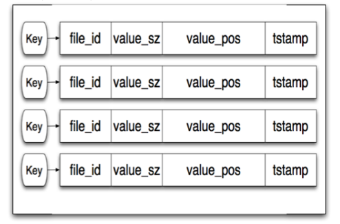
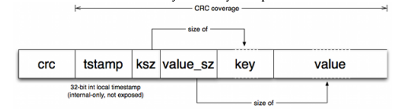
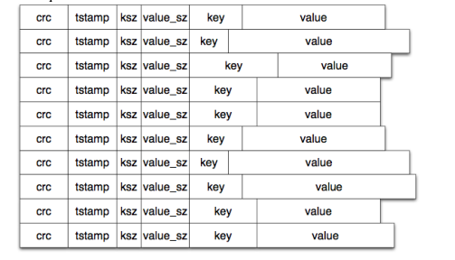
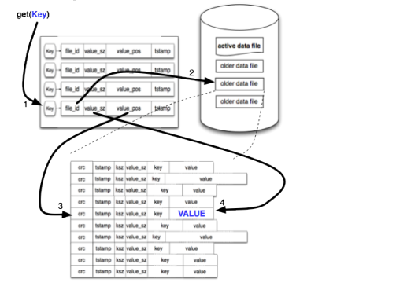
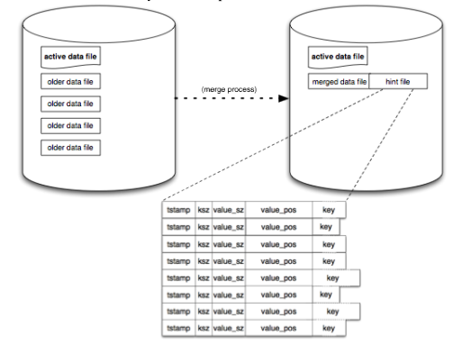

##  bitcask
A simple but fast key-value storage base on [Bitcask](https://riak.com/assets/bitcask-intro.pdf) model.

## Basic Architecture
###  storage format in memory index

### storage format in disk

### read path

### merge process
